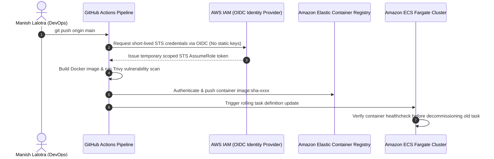

# Architecture 4: Enterprise CI/CD Deployment with GitHub Actions OIDC

```mermaid
sequenceDiagram
    autonumber
    actor Dev as Manish Lalotra (DevOps)
    participant GH as GitHub Actions Pipeline
    participant AWS_IAM as AWS IAM (OIDC Identity Provider)
    participant ECR as Amazon Elastic Container Registry
    participant ECS as Amazon ECS Fargate Cluster

    Dev->>GH: git push origin main
    GH->>AWS_IAM: Request short-lived STS credentials via OIDC (No static keys)
    AWS_IAM-->>GH: Issue temporary scoped STS AssumeRole token
    GH->>GH: Build Docker image & run Trivy vulnerability scan
    GH->>ECR: Authenticate & push container image:sha-xxxx
    GH->>ECS: Trigger rolling task definition update
    ECS->>ECS: Verify container healthcheck before decommissioning old task
```
